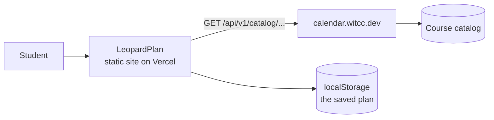

# LeopardPlan

A schedule planner for Wentworth students. You pick filters, you add sections to
a plan, and the plan shows you the week and any time clash before you register.

Built for the [Stellic Pathfinders challenge](https://www.stellic.com/pathfinders).

## How it works

The app is a static site. It holds no database and no accounts. All course data
comes from the WIT Coding Club public catalog API, which needs no key.



The plan lives in `localStorage`, so it survives a reload but never leaves the
browser. The app sends no user data anywhere.

## Getting started

```bash
bun install
cp .env.example .env
bun run dev
```

The app defaults to the production API at `https://calendar.witcc.dev`, so it
works with no `.env` at all. Set `VITE_API_BASE_URL` to point at a local Rails
server instead.

| Command | Effect |
| --- | --- |
| `bun run dev` | Start the dev server |
| `bun run build` | Type check, then build to `dist/` |
| `bun run test` | Run the unit tests |
| `bun run lint` | Run oxlint |
| `bun run typecheck` | Type check only |

## Layout

| Path | Holds |
| --- | --- |
| `src/api/types.ts` | The API payload types. Keep in step with the Rails serializers. |
| `src/api/client.ts` | The fetch client, one function per endpoint |
| `src/lib/schedule.ts` | Clash detection, time maths, week grid layout |
| `src/lib/hooks.ts` | `useAsync`, `useDebounced`, `useStoredState` |
| `src/components/` | The panel, the section list, and the week grid |

## Things to know about the data

- **Seat counts are not live.** They come from Banner, and a nightly job
  refreshes them. They can be up to a day old. The interface says so, and it
  must keep saying so. A student who reads "2 seats left" as a live number will
  make a bad decision with it.
- **A time clash is not the same as a registration block.** The app compares
  meeting times only. It does not know about prerequisites, holds, or class
  standing.
- **The app cannot register you.** It shows CRNs to copy. Registration stays in
  Banner, on purpose.

## API

The catalog API is documented in the `calendar-backend` repo at
`docs/public-catalog-api.md`. It offers the same data over REST and GraphQL. This
app uses REST, because every screen needs one flat list and HTTP caching helps.

Limits worth respecting: 300 requests per minute per IP address, 50 sections per
page by default and 200 at most.

## Deploy

Vercel, as a static build. `vercel.json` sets the framework, the build command,
and a rewrite so a deep link does not 404.
